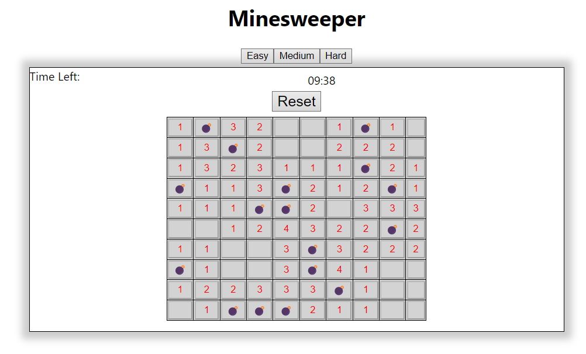
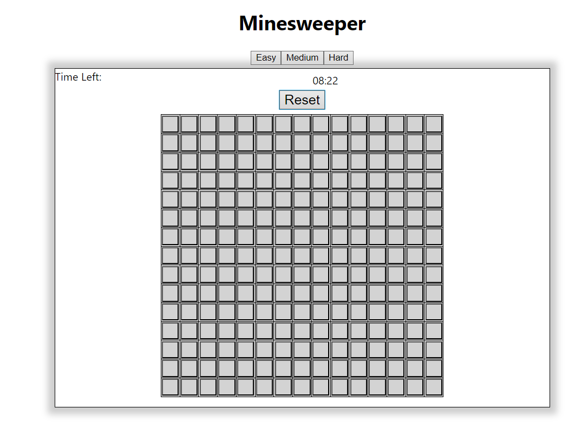

# Project Name

A brief description of what this project does and what problem it solves.

## Table of Contents

- [Installation](#installation)
- [Usage](#usage)
- [Gameplay](#Gameplay)
- [Contributing](#contributing)
- [License](#license)

## Installation

Instructions on how to install and run the project:

1. Clone the repository
2. Install dependencies: `npm install`
3. Start the development server: `npm start`

## Usage

Instructions on how to use the project:

1. Open the browser and navigate to `http://localhost:3000`
2. Follow the on-screen instructions to use the application

## Gameplay

## Contributing

Instructions on how to contribute to the project:

1. Fork the repository
2. Create a new branch: `git checkout -b my-feature-branch`
3. Make changes and commit: `git commit -am 'Add some feature'`
4. Push to the branch: `git push origin my-feature-branch`
5. Submit a pull request

## License

This project is licensed under the [MIT License](https://opensource.org/licenses/MIT).
